# Docker

## Introdução

Esse prejeto tem a finalidade de repassar os conseitos básicos necessários para entender o funcionamento e trabalhar com containers *Dockers*.

## Objetivos

* O que são Containers
* Como funcionam os Containers
* Como o Docker funiona
* Principais comandos utilizando Docker
* Dockerfile
* Trabalhando com imagens Dockers

### O que são Containers?

Um container é um padrão de unidade de software que empacota código e todas dependências de uma palicação fazendo que a mesma seja executada rapidamente de forma confiável de um ambiente computacional para o outro.

```
Fonte: docker.com
```
### Como funcionam os Containers?

Exemplo-1 - S.O

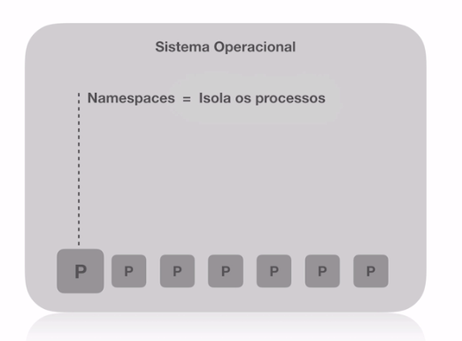

Exemplo-2 - Containers

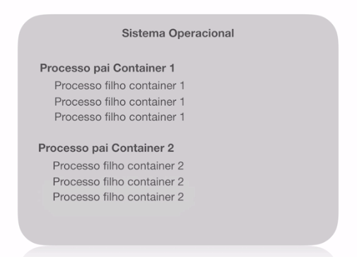

Exemplo-3 - Namespaces

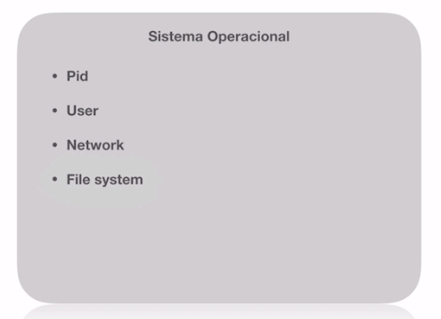

Exemplo-4 - Cgroups

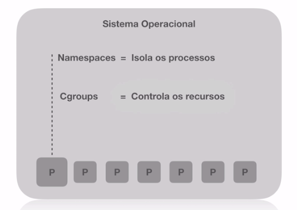
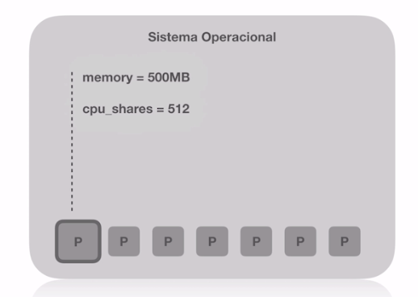

Exemple-5 - File System

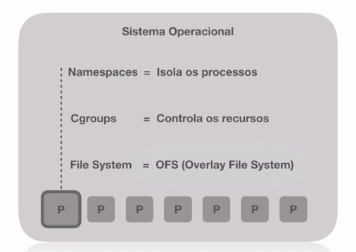
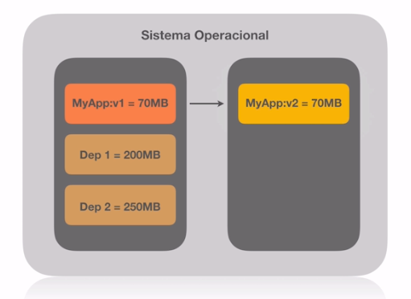

Exemplo-6 - Imagens Containers

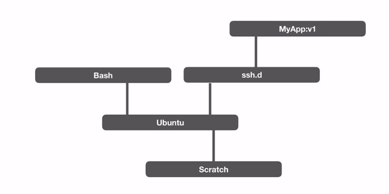
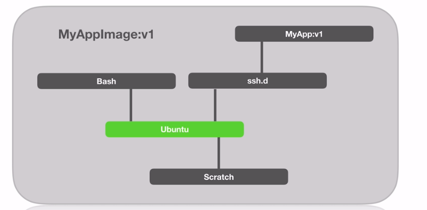

Exemplo-7 - Dockerfile

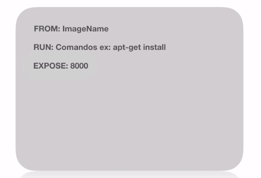
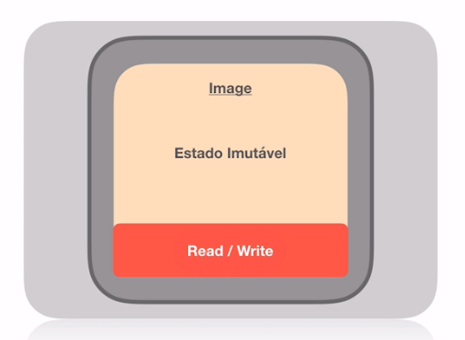
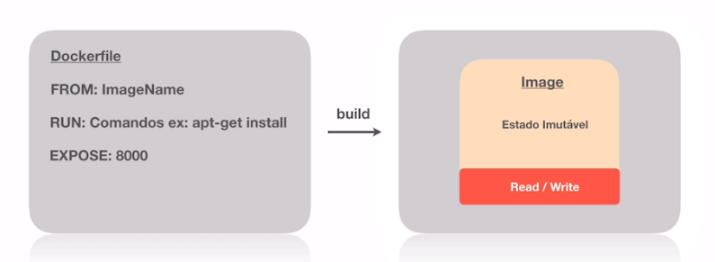
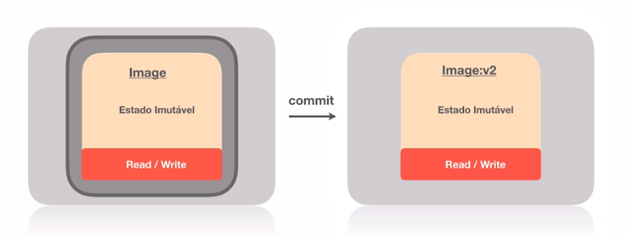
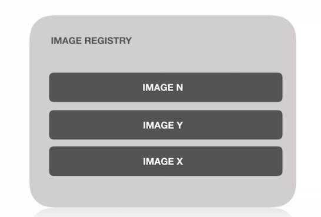
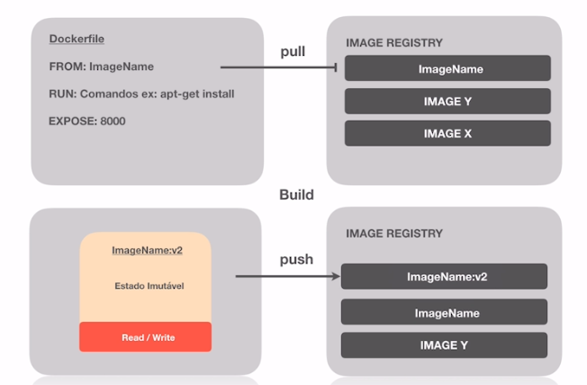

Exemplo-8 - Estrutura básica

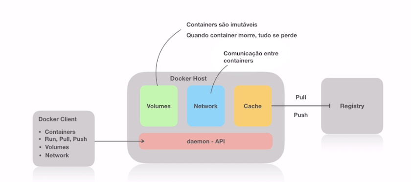